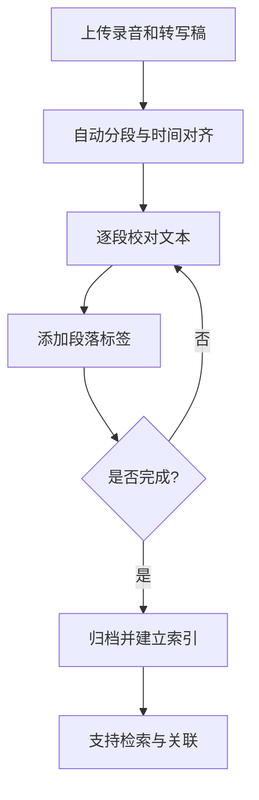
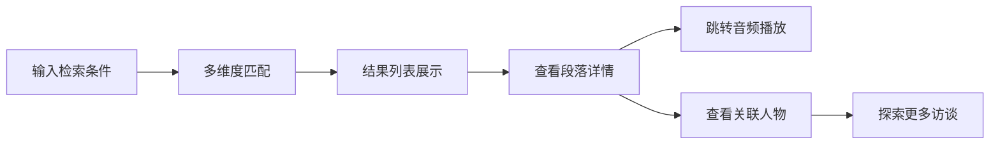

## 1. 产品概述

口述历史档案管理工作台，帮助档案馆馆员系统化管理口述历史录音与访谈稿。解决录音、转写文本、人物关系、地名事件标签分散处理的痛点，提供统一的资料沉淀、校对、标签和检索平台，避免每批采访重新搭建表格的重复劳动。

- **目标用户**：档案馆馆员、口述历史研究者
- **核心价值**：一体化管理音频、文本、标签，支持跨访谈人物关联，提供高效检索能力

## 2. 核心功能

### 2.1 用户角色

| 角色 | 登录方式 | 核心权限 |
|------|----------|----------|
| 馆员 | 本地账户 | 访谈管理、文本校对、标签维护、全文检索 |

### 2.2 功能模块

1. **仪表盘**：数据概览、最近访谈、快捷操作入口
2. **访谈管理**：访谈列表、新增访谈、录音上传、转写稿导入
3. **文本校对工作台**：音频播放与文本同步、逐段校对、时间轴标记
4. **标签管理**：人物标签、地点标签、年代标签、事件标签的增删改查
5. **检索中心**：多维度检索（人物、地点、年代、事件、关键词）、结果高亮、跨访谈人物关联
6. **人物档案**：人物详情页、关联访谈片段列表、人物关系图谱

### 2.3 页面详情

| 页面名称 | 模块名称 | 功能描述 |
|-----------|-------------|---------------------|
| 仪表盘 | 数据统计卡片 | 访谈总数、段落总数、人物标签数、地点标签数 |
| 仪表盘 | 最近访谈列表 | 显示最近编辑的5条访谈记录 |
| 仪表盘 | 快捷操作 | 新建访谈、上传音频、导入转写稿 |
| 访谈列表页 | 筛选栏 | 按人物、地点、年代、状态筛选 |
| 访谈列表页 | 访谈卡片 | 显示标题、受访者、时长、标签、进度 |
| 访谈列表页 | 批量操作 | 批量打标签、批量导出 |
| 访谈详情/校对页 | 音频播放器 | 播放控制、进度条、倍速、快捷键 |
| 访谈详情/校对页 | 文本段落列表 | 逐段显示、时间标记、编辑状态、标签 |
| 访谈详情/校对页 | 段落编辑器 | 内联编辑、保存、撤销 |
| 访谈详情/校对页 | 标签面板 | 为段落添加人物/地点/年代/事件标签 |
| 标签管理页 | 标签分类标签页 | 人物、地点、年代、事件四个分类 |
| 标签管理页 | 标签列表 | 标签名称、使用次数、关联访谈数 |
| 标签管理页 | 标签编辑 | 新增、编辑、合并、删除标签 |
| 检索中心页 | 搜索框 | 全文搜索、高级筛选 |
| 检索中心页 | 结果列表 | 访谈级结果、段落级结果、高亮显示 |
| 检索中心页 | 筛选侧边栏 | 按标签维度筛选结果 |
| 人物详情页 | 人物信息 | 姓名、别名、生卒年、简介 |
| 人物详情页 | 关联片段 | 所有涉及该人物的段落列表 |
| 人物详情页 | 相关人物 | 通过共同访谈关联的人物网络 |

## 3. 核心流程

### 3.1 访谈整理流程

馆员上传录音文件和初始转写稿 → 系统自动按时间轴分段 → 馆员逐段校对文本 → 为段落添加人物/地点/年代/事件标签 → 完成校对后归档 → 支持检索和人物关联

### 3.2 检索使用流程

用户输入关键词或选择标签 → 系统返回匹配的访谈和段落 → 点击查看详情 → 可跳转到对应音频位置 → 查看相关人物和关联访谈

## 4. 用户界面设计

### 4.1 设计风格

- **主色调**：深墨蓝（#1e3a5f）作为主色，传达档案的庄重与专业感
- **辅助色**：古铜金（#c9a962）作为点缀，体现历史厚重感
- **中性色**：暖灰白（#f5f2eb）背景，深灰文字（#2d2d2d）
- **按钮风格**：微圆角（4px）、轻微阴影、悬停渐变色
- **字体**：标题使用「思源宋体」体现人文气息，正文使用「思源黑体」保证可读性
- **布局风格**：三栏布局（侧边导航 + 主内容区 + 详情/标签面板）
- **图标风格**：线性图标，统一 1.5px 线宽
- **整体氛围**：学术、稳重、高效，带有图书馆/档案馆的人文质感

### 4.2 页面设计概览

| 页面名称 | 模块名称 | UI元素 |
|-----------|-------------|-------------|
| 仪表盘 | 统计卡片 | 渐变背景、大数字、图标、微动效 |
| 仪表盘 | 最近访谈 | 卡片列表、悬停效果、进度条 |
| 访谈列表 | 筛选栏 | 标签式筛选、搜索框、排序下拉 |
| 访谈列表 | 访谈卡片 | 封面色块、标题、标签徽章、元信息 |
| 校对工作台 | 音频播放器 | 深色播放器条、波形示意、时间显示 |
| 校对工作台 | 段落列表 | 交替背景、当前播放高亮、编辑状态标记 |
| 校对工作台 | 标签面板 | 标签气泡、分类色标、添加输入框 |
| 检索中心 | 搜索区 | 大搜索框、高级筛选展开面板 |
| 检索中心 | 结果列表 | 段落摘要、关键词高亮、标签组 |
| 人物详情 | 信息卡 | 头像占位、姓名、基本信息网格 |
| 人物详情 | 时间线 | 按年代排列的关联片段 |

### 4.3 响应式

- **桌面优先**：1280px 以上为主要设计目标
- **平板适配**：1024px 时收起右侧标签面板，可展开
- **移动端**：768px 以下转为单栏布局，侧边栏变为抽屉式
- 核心操作（播放、编辑、搜索）确保触屏可用

### 4.4 交互细节

- 音频播放时，当前段落自动滚动到视野中央并有高亮动画
- 段落编辑时支持快捷键（Ctrl+S 保存、Tab 下一段）
- 标签输入支持自动补全和快捷创建
- 检索结果支持键盘上下键导航
- 页面切换有淡入过渡效果
