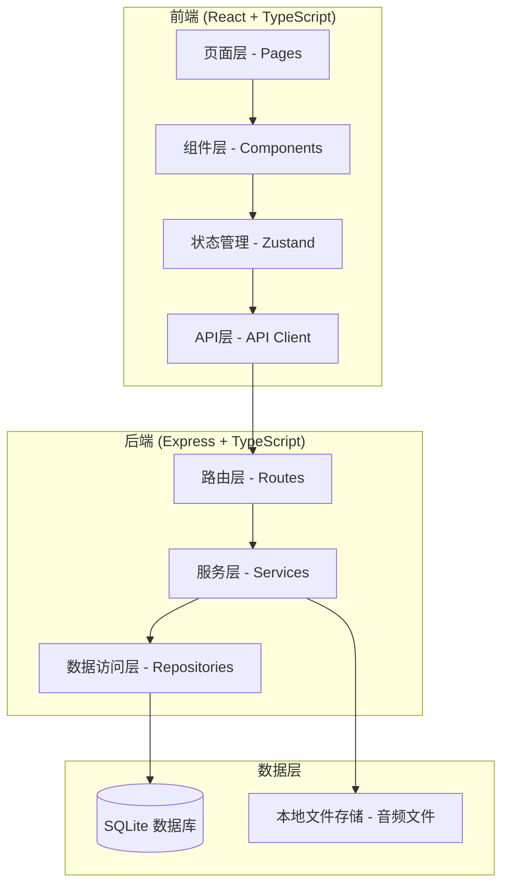
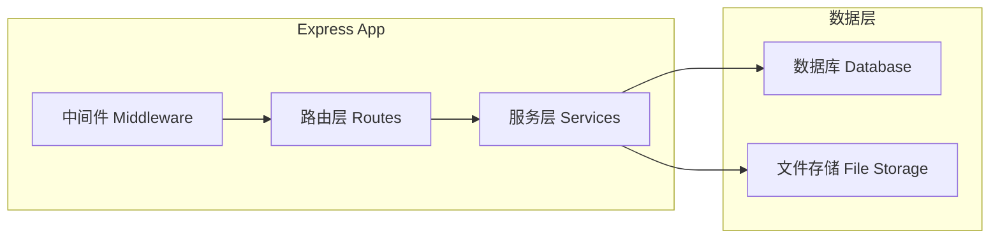
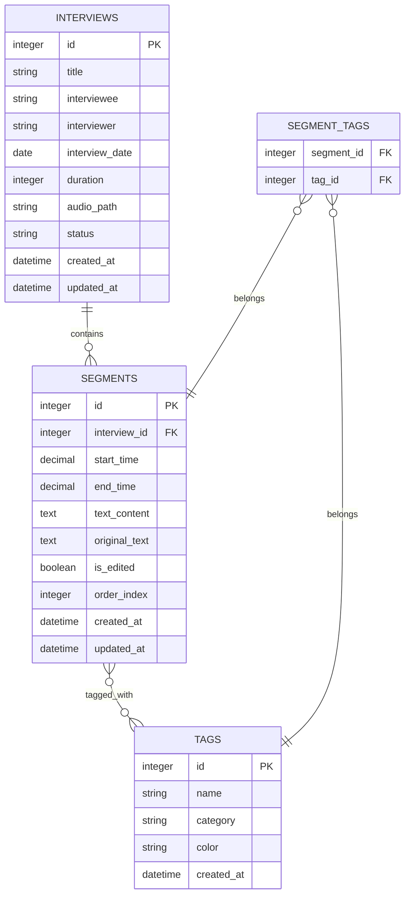

## 1. 架构设计



## 2. 技术描述

- **前端**：React@18 + TypeScript + Vite + TailwindCSS@3 + Zustand + React Router
- **后端**：Express@4 + TypeScript
- **数据库**：SQLite（本地文件数据库，适合单机部署和档案管理场景）
- **文件存储**：本地文件系统（uploads 目录）
- **音频处理**：HTML5 Audio API
- **搜索**：SQLite FTS5 全文搜索

## 3. 路由定义

### 前端路由

| 路由路径 | 页面名称 | 功能描述 |
|----------|----------|----------|
| / | 仪表盘 | 数据概览、快捷操作、最近访谈 |
| /interviews | 访谈列表 | 访谈列表展示、筛选、搜索 |
| /interviews/:id | 访谈详情/校对 | 音频播放、文本校对、标签编辑 |
| /tags | 标签管理 | 人物/地点/年代/事件标签管理 |
| /search | 检索中心 | 全文检索、多维度筛选 |
| /people/:id | 人物详情 | 人物信息、关联访谈片段 |

### 后端 API 路由

| 方法 | 路径 | 功能描述 |
|------|------|----------|
| GET | /api/interviews | 获取访谈列表 |
| GET | /api/interviews/:id | 获取访谈详情（含段落） |
| POST | /api/interviews | 创建访谈 |
| PUT | /api/interviews/:id | 更新访谈信息 |
| DELETE | /api/interviews/:id | 删除访谈 |
| POST | /api/interviews/:id/audio | 上传音频文件 |
| POST | /api/interviews/:id/import | 导入转写稿 |
| GET | /api/segments/:id | 获取段落详情 |
| PUT | /api/segments/:id | 更新段落文本 |
| PUT | /api/segments/:id/tags | 更新段落标签 |
| GET | /api/tags | 获取标签列表（按分类） |
| POST | /api/tags | 创建标签 |
| PUT | /api/tags/:id | 更新标签 |
| DELETE | /api/tags/:id | 删除标签 |
| POST | /api/tags/merge | 合并标签 |
| GET | /api/search | 全文搜索 |
| GET | /api/people/:id | 获取人物详情及关联片段 |
| GET | /api/stats | 获取仪表盘统计数据 |

## 4. API 定义

### 类型定义

```typescript
// 访谈
interface Interview {
  id: number;
  title: string;
  interviewee: string;
  interviewer: string;
  interviewDate: string | null;
  duration: number; // 秒
  audioUrl: string | null;
  status: 'draft' | 'editing' | 'completed';
  segmentCount: number;
  createdAt: string;
  updatedAt: string;
}

// 段落
interface Segment {
  id: number;
  interviewId: number;
  startTime: number; // 秒
  endTime: number;
  text: string;
  originalText: string;
  isEdited: boolean;
  orderIndex: number;
  tags: Tag[];
}

// 标签
interface Tag {
  id: number;
  name: string;
  category: 'person' | 'location' | 'era' | 'event';
  color: string;
  usageCount: number;
}

// 人物详情
interface PersonDetail {
  id: number;
  name: string;
  aliases: string[];
  birthYear: number | null;
  deathYear: number | null;
  description: string;
  relatedSegments: Segment[];
  relatedPeople: { id: number; name: string; interviewCount: number }[];
}

// 搜索结果
interface SearchResult {
  type: 'interview' | 'segment';
  id: number;
  interviewId: number;
  interviewTitle: string;
  highlightText: string;
  matchedTags: Tag[];
  startTime?: number;
}
```

## 5. 服务端架构图



## 6. 数据模型

### 6.1 数据模型定义



### 6.2 数据定义语言 (DDL)

```sql
-- 访谈表
CREATE TABLE interviews (
    id INTEGER PRIMARY KEY AUTOINCREMENT,
    title TEXT NOT NULL,
    interviewee TEXT,
    interviewer TEXT,
    interview_date DATE,
    duration INTEGER DEFAULT 0,
    audio_path TEXT,
    status TEXT DEFAULT 'draft',
    created_at DATETIME DEFAULT CURRENT_TIMESTAMP,
    updated_at DATETIME DEFAULT CURRENT_TIMESTAMP
);

-- 段落表
CREATE TABLE segments (
    id INTEGER PRIMARY KEY AUTOINCREMENT,
    interview_id INTEGER NOT NULL,
    start_time REAL NOT NULL DEFAULT 0,
    end_time REAL NOT NULL DEFAULT 0,
    text_content TEXT NOT NULL DEFAULT '',
    original_text TEXT NOT NULL DEFAULT '',
    is_edited INTEGER NOT NULL DEFAULT 0,
    order_index INTEGER NOT NULL DEFAULT 0,
    created_at DATETIME DEFAULT CURRENT_TIMESTAMP,
    updated_at DATETIME DEFAULT CURRENT_TIMESTAMP,
    FOREIGN KEY (interview_id) REFERENCES interviews(id) ON DELETE CASCADE
);

-- 标签表
CREATE TABLE tags (
    id INTEGER PRIMARY KEY AUTOINCREMENT,
    name TEXT NOT NULL UNIQUE,
    category TEXT NOT NULL,
    color TEXT,
    created_at DATETIME DEFAULT CURRENT_TIMESTAMP
);

-- 段落-标签关联表
CREATE TABLE segment_tags (
    segment_id INTEGER NOT NULL,
    tag_id INTEGER NOT NULL,
    PRIMARY KEY (segment_id, tag_id),
    FOREIGN KEY (segment_id) REFERENCES segments(id) ON DELETE CASCADE,
    FOREIGN KEY (tag_id) REFERENCES tags(id) ON DELETE CASCADE
);

-- 全文搜索虚拟表（FTS5）
CREATE VIRTUAL TABLE segments_fts USING fts5(
    text_content,
    content='segments',
    content_rowid='id'
);

-- 索引
CREATE INDEX idx_segments_interview_id ON segments(interview_id);
CREATE INDEX idx_tags_category ON tags(category);
CREATE INDEX idx_segment_tags_tag_id ON segment_tags(tag_id);
CREATE INDEX idx_interviews_status ON interviews(status);
```

### 6.3 初始数据

```sql
-- 预置一些示例标签
INSERT INTO tags (name, category, color) VALUES
    ('张三', 'person', '#e74c3c'),
    ('李四', 'person', '#3498db'),
    ('北京市', 'location', '#2ecc71'),
    ('上海市', 'location', '#f39c12'),
    ('1950年代', 'era', '#9b59b6'),
    ('1960年代', 'era', '#1abc9c'),
    ('改革开放', 'event', '#e67e22'),
    ('抗美援朝', 'event', '#c0392b');
```
